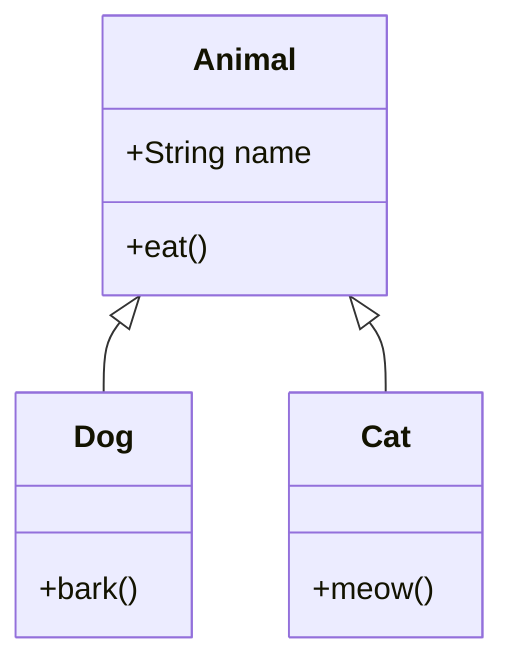

## Mermaid

> 官网学习地址：https://mermaid.nodejs.cn/syntax/flowchart.html

1. 程序流程图

   - 程序开头必须是`graph`，后面加上方向代码`TD/TB(从上到下)`或`LR(从左到右)`
   - 括号外面定义的即为节点代号，括号定义形状
   - `[]`表示矩形,`()`表示圆角矩形（通常用于流程的起点和终点），`{}`表示菱形，用于条件判断
   - `-->`表示实现箭头，`---`表示不带箭头的实现，`-.->`表示虚线箭头, `--text-->`为箭头添加描述

   ~~~mermaid
   graph LR
   	A(start) --> B{whether pass}
   	B --yes--> C[excute task]
   	B --no--> D[modify]
   	D --> B
   ~~~

2. 饼图

   ~~~mermaid
   pie
       title 程序员的一天时间分配
       "写代码" : 8
       "开会" : 2
       "修Bug" : 4
       "摸鱼喝水" : 3
       "睡觉" : 7
   ~~~

   

3. 思维导图

   - 以`mindmap`关键字开头
   - 第一行是中心主题
   - 通过换行和缩进来区分层级

   ~~~mermaid
   %%{init: {'theme': 'default'}}%%
   mindmap
   	root((topic))
   		A
   			a1
   			a2
   		B
   			b1
   				b11
   			b2
   ~~~

4. 类图

   |  元素  |      语法      |      描述      |
   | :----: | :------------: | :------------: |
   |   类   | `class name{}` | - |
   |  接口  | `<<interface>>`  | - |
   | 抽象类 | `<<abstract>>` | - |
   |  枚举  | `<<enumeration>>` | - |
   |  属性  | `+ name: type` | + pulic，- private，# protected |
   |  方法  | `+ name(args): returnType` |  |

   ~~~mermaid
   classDiagram
   	class User{
   		-name: String
   		-age: int
   		+login()
   		-enctrypt()
   	}
   ~~~
   
   | 关系     | 符号   | 方向               | 含义               | 代码示例                  |
   | -------- | ------ | ------------------ | ------------------ | ------------------------- |
   | **继承** | `<|--` | 子类指向父类       | "is-a"             | `Dog <|-- Animal`         |
   | **实现** | `<|..` | 实现类指向接口     | 契约实现           | `Car <|.. Vehicle`        |
   | **组合** | `*--`  | 整体指向部分       | 强拥有，同生共死   | `House *-- Room`          |
   | **聚合** | `o--`  | 整体指向部分       | 弱拥有，可独立存在 | `Department o-- Employee` |
   | **关联** | `--`   | 双向或单向         | 长期关系           | `User -- Role`            |
   | **依赖** | `..>`  | 使用方指向被使用方 | 临时使用           | `Controller ..> Service`  |

​	

